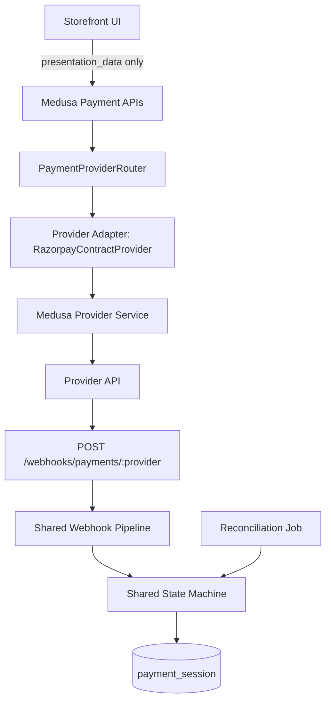

# Payments Overview (Foundation)

## Purpose

This folder is the canonical foundation for pluggable payments in this project.

- Backend payment truth lives in Medusa.
- Storefront consumes only safe `presentation_data` from backend.
- Provider-specific internals are isolated behind shared contracts and shared webhook/reconciliation infrastructure.

## Architecture

## Core Building Blocks

### Canonical Payment Language

- `payments/types.ts`
  - `PaymentStatus`
  - `PaymentErrorCode`
  - `PaymentEvent`
  - Standard error shape:
    - `{ "error": { "code", "message", "details", "correlation_id" } }`

### State Machine

- Canonical engine: `payments/stateMachine.ts`
- Medusa adapter: `src/modules/payments-core/state-machine.ts`
- Rules and transitions: `docs/payments/state-machine.md`

### Provider Contract

- `payments/provider/IPaymentProvider.ts`
  - `initiatePayment`, `authorizePayment`, `capturePayment`, `refundPayment`, `cancelPayment`, `getCapabilities`
  - strict DTO validation for inputs/outputs
- Contract test harness: `payments/tests/providerContractSuite.ts`

### Provider Routing

- `src/modules/payments-core/provider-router.ts`
- Env:
  - `PAYMENT_PROVIDER_DEFAULT` (fallback `cod`)
  - `PAYMENTS_ENABLED` (`false` => fail fast with `PROVIDER_UNAVAILABLE`)
- Routing rules:
  - new payment: default provider
  - existing payment: stored `payment_session.provider_id`
  - boot guard: configured `PAYMENT_PROVIDER_DEFAULT` must be registered

### Presentation Data

- Builder: `src/modules/payments-core/presentation-data.ts`
- Output type union in `payments/types.ts`:
  - Razorpay: `{ type: "razorpay", keyId, orderId, amount, currency, prefill? }`
  - Stripe: `{ type: "stripe", clientSecret }`
- Frontend must render from this object only.

## Endpoints

- Shared webhook route: `POST /webhooks/payments/:provider`
- Razorpay compatibility alias: `POST /webhooks/razorpay` (deprecated; use canonical route)
- Dev metrics snapshot: `GET /admin/observability/metrics` (development only)

## Supporting Docs

- State machine: `docs/payments/state-machine.md`
- Webhooks: `docs/payments/webhooks.md`
- Observability: `docs/payments/observability.md`
- Reconciliation: `docs/payments/reconciliation.md`
- Add provider checklist: `docs/payments/adding-a-provider.md`
- Razorpay implementation details: `docs/payments/razorpay.md`
- Error testing matrix: `docs/payments/error-testing-matrix.md`
