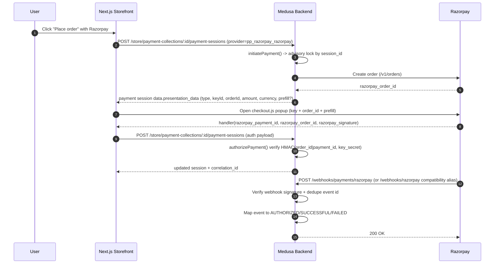

# Razorpay Integration (Medusa v2 + Next.js)

## Overview

Razorpay is the online payment provider for checkout cards/UPI/netbanking in this stack.

- Medusa backend is the source of truth for payment amount, currency, session state, and authorization.
- Next.js storefront is UI-only for checkout popup and user interactions.
- Secrets (`RAZORPAY_KEY_SECRET`, `RAZORPAY_WEBHOOK_SECRET`) never leave backend runtime.

### v1 Scope

- Currency: INR only (hard-enforced in backend).
- Order creation: one Razorpay order per Medusa payment session.
- Authorization: server-side HMAC signature verification required.
- Reconciliation: webhook-driven state reconciliation with dedupe.
- Refunds: supported for captured payments (stored as `razorpay_refund_id` and `refunded_at`).

## Architecture



### Data Flow Boundaries

Sent to frontend (safe):

- `presentation_data` object from backend:
  - `{ type: "razorpay", keyId, orderId, amount, currency, prefill? }`
- `correlation_id`

Backend-only (never exposed):

- `RAZORPAY_KEY_SECRET`
- `RAZORPAY_WEBHOOK_SECRET`
- Raw webhook payload processing internals
- Full upstream auth error internals beyond sanitized fields

## Environment Setup

Required env vars:

- `PAYMENTS_MODE` (`test` or `live`)
- `RAZORPAY_KEY_ID`
- `RAZORPAY_KEY_SECRET`
- `RAZORPAY_WEBHOOK_SECRET` (required in `live` mode)

Related flags:

- `ENABLE_RAZORPAY=true` to force provider enablement.
- `RAZORPAY_TEST_AUTO_AUTHORIZE=false` in `.env.template` (opt-in only).
- `PAYMENTS_ALLOW_UNVERIFIED_WEBHOOKS=false` by default. Set `true` only for controlled emergency testing.
- `PAYMENTS_RECONCILIATION_CRON` (optional; defaults to `*/20 * * * *`).
- `PAYMENTS_RECONCILIATION_STUCK_MINUTES` (optional; defaults to `30`).
- `PAYMENTS_RECONCILIATION_MAX_SESSIONS` (optional; defaults to `200`).

### Boot Guardrails

Implemented in `src/modules/payment-razorpay/config.ts` and `medusa-config.ts`:

- Missing `RAZORPAY_KEY_ID` or `RAZORPAY_KEY_SECRET` -> `RAZORPAY_CONFIG_MISSING`
- `PAYMENTS_MODE=test` + `rzp_live_` key -> `RAZORPAY_CONFIG_MODE_MISMATCH`
- `PAYMENTS_MODE=live` + `rzp_test_` key -> `RAZORPAY_CONFIG_MODE_MISMATCH`
- `PAYMENTS_MODE=live` + missing `RAZORPAY_WEBHOOK_SECRET` -> `RAZORPAY_CONFIG_MISSING`
- Provider registration missing -> `RAZORPAY_PROVIDER_REGISTRATION_FAILED`

Safe setup guidance:

- WIP/testing: use `PAYMENTS_MODE=test` + `rzp_test_*` keys + test webhook secret.
- Production: switch to `PAYMENTS_MODE=live`, use `rzp_live_*` keys, configure real webhook secret before boot.

## Provider Implementation Details

Core module location:

- Shared foundation:
  - `src/modules/payments-core/contracts.ts`
  - `src/modules/payments-core/state-machine.ts`
  - `src/modules/payments-core/presentation-data.ts`
  - `src/modules/payments-core/webhook-policy.ts`
  - `src/modules/payments-core/reconciliation.ts`
- `src/modules/payment-razorpay/index.ts`
- `src/modules/payment-razorpay/contract-provider.ts`
- `src/modules/payment-razorpay/service.ts`
- `src/modules/payment-razorpay/client.ts`
- `src/modules/payment-razorpay/config.ts`
- `src/modules/payment-razorpay/webhook-event-repository.ts`

Registration:

- `medusa-config.ts` registers provider with id `razorpay`.
- Store payment session provider id appears as `pp_razorpay_razorpay`.

Implemented behavior:

- `initiatePayment`:
  - Validates INR.
  - Creates/returns one Razorpay order for a payment session.
  - Returns checkout-safe `presentation_data` through `getPaymentPresentationData(...)`.
- `authorizePayment`:
  - Requires `razorpay_order_id`, `razorpay_payment_id`, `razorpay_signature`.
  - Verifies `HMAC_SHA256(order_id|payment_id, RAZORPAY_KEY_SECRET)` with timing-safe compare.
  - Marks payment as `AUTHORIZED` on success through the shared payment state machine.
- Webhook handling:
  - Canonical endpoint: `POST /webhooks/payments/:provider` (`src/api/webhooks/payments/[provider]/route.ts`).
  - Compatibility endpoint: `POST /webhooks/razorpay` (`src/api/webhooks/razorpay/route.ts`) delegates to the canonical shared pipeline with `provider=razorpay`.
  - Signature validation + mapping + dedupe are handled in shared webhook pipeline (`src/modules/payments-core/webhook-pipeline.ts`).
  - By default, unverified webhooks are rejected. Explicit override: `PAYMENTS_ALLOW_UNVERIFIED_WEBHOOKS=true`.
  - Event mapping:
    - `payment.authorized` -> authorized action
    - `payment.captured` -> successful/captured action
    - `payment.failed` -> failed/error action
  - Idempotent processing via dedupe table and state checks.
- `cancelPayment`:
  - Cancels only unpaid sessions.
  - Paid sessions return `CANNOT_CANCEL_PAID_PAYMENT`.
- `refundPayment`:
  - Calls `POST /v1/payments/:id/refund` for captured payments.
  - Stores `razorpay_refund_id` and transitions internal status to `REFUNDED`.

INR-only enforcement:

- `ensureInrCurrency(...)` in `src/modules/payment-razorpay/service.ts` (used in initiate/update/capture paths).

## Idempotency + Concurrency

### Preventing Duplicate Razorpay Orders

Storage table:

- `razorpay_session_order_v1`
  - `payment_session_id` (PK)
  - `razorpay_order_id` (UNIQUE)
  - `amount`, `currency_code`, `attempt_count`, `created_at`

Locking approach:

- PostgreSQL advisory transaction lock:
  - `pg_advisory_xact_lock(hashtext('razorpay:session-order:<session_id>'))`

Rule:

- Inside lock, read existing row by `payment_session_id`.
- If existing `razorpay_order_id` exists, return it (no new Razorpay order).
- If no row, create Razorpay order and persist.

### Webhook Dedupe

Table:

- `razorpay_webhook_events`
  - `id` (PK, unique)
  - `event_type`
  - `provider_payment_id`
  - `created_at`

Dedupe behavior:

- Insert by event id (`x-razorpay-event-id`) or derived payload hash if header missing.
- `ON CONFLICT (id) DO NOTHING`.
- Duplicate events are ignored and logged as `WEBHOOK_DEDUP_HIT`.

## Error Handling Contract

Backend error envelope:

```json
{
  "code": "ERROR_CODE",
  "message": "Human readable message. Support Code: <correlation-id>.",
  "details": {},
  "correlation_id": "uuid-or-forwarded-id",
  "error": {
    "code": "ERROR_CODE",
    "message": "Human readable message",
    "details": {},
    "correlation_id": "uuid-or-forwarded-id"
  }
}
```

Common Razorpay error codes:

- `RAZORPAY_CONFIG_MISSING`: required env missing.
- `RAZORPAY_CONFIG_MODE_MISMATCH`: key prefix does not match mode.
- `RAZORPAY_PROVIDER_REGISTRATION_FAILED`: provider missing at boot.
- `CURRENCY_NOT_SUPPORTED`: non-INR request.
- `VALIDATION_ERROR`: missing required authorization fields.
- `SIGNATURE_INVALID`: checkout signature mismatch.
- `RAZORPAY_SIGNATURE_INVALID`: webhook signature mismatch.
- `RAZORPAY_SIGNATURE_MISSING`: missing webhook signature header.
- `RAZORPAY_WEBHOOK_SECRET_MISSING`: backend webhook secret missing.
- `RAZORPAY_AUTH_FAILED`: upstream 401/403.
- `RAZORPAY_BAD_REQUEST`: upstream 400.
- `RAZORPAY_RATE_LIMIT`: upstream 429 after retries.
- `RAZORPAY_UPSTREAM_ERROR`: upstream 5xx/network failure.
- `RAZORPAY_AMOUNT_IMMUTABLE`: amount changed for same session.
- `CANNOT_CANCEL_PAID_PAYMENT`: cancel attempted on paid session.

Canonical pluggable adapter mapping (`src/modules/payment-razorpay/contract-provider.ts`):

- `RAZORPAY_AUTH_FAILED` (or 401/403) -> `AUTH_FAILED`
- `RAZORPAY_RATE_LIMIT` (or 429) -> `RATE_LIMITED`
- `RAZORPAY_UPSTREAM_ERROR` / network / 5xx -> `UPSTREAM_ERROR`
- `RAZORPAY_SIGNATURE_INVALID` / `SIGNATURE_INVALID` -> `SIGNATURE_INVALID`

Correlation id propagation:

- Request header in: `x-correlation-id` (if provided).
- Backend generates UUID when absent.
- Response header out: `x-correlation-id`.
- Response body: `correlation_id` (success and error paths).
- Logs include `correlation_id`.
- Storefront shows `Support Code` based on correlation id on failure.

Internal payment language:

- Shared state language: `PaymentStatus` (`PENDING`, `AUTHORIZED`, `CAPTURED`, `FAILED`, `CANCELED`, `REFUNDED`).
- Shared error base: `PaymentProviderError` + standard error envelope with `correlation_id`.

## Operational Playbook

### Debug a Payment

1. Capture `Support Code` from UI or `x-correlation-id` from response.
2. Inspect payment session metadata:
   - `GET /admin/ops/debug/razorpay-payment?cart_id=<id>`
   - or `GET /admin/ops/debug/razorpay-payment?order_id=<id>`
3. Check fields:
   - `razorpay_order_id`
   - `razorpay_payment_id`
   - `razorpay_payment_status`
   - `verified_at`, `authorized_at`, `captured_at`
4. Search logs by `correlation_id` for sequence:
   - `RAZORPAY_ORDER_CREATED`
   - `RAZORPAY_CHECKOUT_INITIATED`
   - `RAZORPAY_SIGNATURE_OK` / `RAZORPAY_SIGNATURE_FAIL`
   - `RAZORPAY_WEBHOOK_RECEIVED` / `RAZORPAY_WEBHOOK_PROCESSED` / `RAZORPAY_WEBHOOK_FAILED`

### Common Failures and Fixes

- Checkout script load failure:
  - UI: `Payment init failed, retry`.
  - Check CSP allows `checkout.razorpay.com` and network connectivity.
- Popup blocked:
  - UI: `Allow popups`.
  - Browser popup permissions required.
- Signature invalid (checkout):
  - Verify frontend sent all 3 fields exactly.
  - Confirm server key secret is correct for environment.
- Webhook signature invalid:
  - Check `RAZORPAY_WEBHOOK_SECRET` matches Razorpay dashboard webhook config.
- Rate limiting (`429`):
  - Backend retries with exponential backoff + jitter (max 3 attempts).
  - If still failing, response maps to `RAZORPAY_RATE_LIMIT`.
- Stuck pending/authorized sessions:
  - Scheduled reconciliation job (`src/jobs/payment-reconciliation.ts`) scans stale sessions and reconciles forward transitions idempotently.
  - Check logs for `PAYMENT_RECONCILIATION_*` events.

### Anti-Patterns (Do Not Do)

- Do not trust amount/currency from frontend payload.
- Do not mark payment paid without server-side signature verification.
- Do not log secrets, auth headers, or full webhook payload with PII.
- Do not expose `RAZORPAY_KEY_SECRET`/webhook secret to Next.js/client.

## Testing and QA

Primary QA runbook:

- `docs/razorpay-wip-test.md`

Key automated tests:

- Backend config guardrails:
  - `src/modules/payment-razorpay/__tests__/config.unit.spec.ts`
  - `src/__tests__/medusa-config-guardrails.unit.spec.tsx`
- Razorpay client retry/typed errors:
  - `src/modules/payment-razorpay/__tests__/client.unit.spec.ts`
- Provider methods (initiate/authorize/cancel/refund/webhook):
  - `src/modules/payment-razorpay/__tests__/service.unit.spec.tsx`
- Webhook dedupe repository:
  - `src/modules/payment-razorpay/__tests__/webhook-event-repository.unit.spec.ts`
- Webhook route behavior:
  - `src/api/webhooks/razorpay/__tests__/route.unit.spec.tsx`
- Shared payments foundation:
  - `src/modules/payments-core/__tests__/contracts.unit.spec.ts`
  - `src/modules/payments-core/__tests__/state-machine.unit.spec.ts`
  - `src/modules/payments-core/__tests__/webhook-policy.unit.spec.ts`
  - `src/modules/payments-core/__tests__/reconciliation.unit.spec.ts`
  - `src/modules/payment-razorpay/__tests__/provider-contract-suite.unit.spec.tsx`
- Reconciliation job:
  - `src/jobs/__tests__/payment-reconciliation.unit.spec.ts`
- Correlation propagation:
  - `src/api/__tests__/correlation-id-propagation.unit.spec.tsx`
- Debug endpoint:
  - `src/api/admin/__tests__/razorpay-debug-route.unit.spec.tsx`
- Storefront Razorpay client utilities:
  - `svb-storefront/src/modules/checkout/components/payment-button/__tests__/razorpay-client.node.test.mts`

Run commands (examples):

- Backend: `yarn test:unit -- src/modules/payment-razorpay/__tests__/service.unit.spec.tsx`
- Provider contract suite: `yarn test:unit -- src/modules/payment-razorpay/__tests__/provider-contract-suite.unit.spec.tsx`
- Backend webhook route: `yarn test:unit -- src/api/webhooks/razorpay/__tests__/route.unit.spec.tsx`
- Shared payments core: `yarn test:unit -- src/modules/payments-core/__tests__/contracts.unit.spec.ts src/modules/payments-core/__tests__/state-machine.unit.spec.ts src/modules/payments-core/__tests__/webhook-policy.unit.spec.ts src/modules/payments-core/__tests__/reconciliation.unit.spec.ts`
- Storefront node test: `node --test --experimental-strip-types src/modules/checkout/components/payment-button/__tests__/razorpay-client.node.test.mts`

Postman smoke test:

- `GET https://api.razorpay.com/v1/payments` with Basic Auth (`RAZORPAY_KEY_ID` / `RAZORPAY_KEY_SECRET`) should return 200.
- Full Postman flow is documented in `docs/razorpay-wip-test.md`.

## Going Live Checklist

1. Set `PAYMENTS_MODE=live`.
2. Set `RAZORPAY_KEY_ID=rzp_live_*`.
3. Set `RAZORPAY_KEY_SECRET` (live key).
4. Set `RAZORPAY_WEBHOOK_SECRET` from Razorpay live webhook configuration.
5. Confirm app boots cleanly (guardrails pass).
6. Verify checkout authorization path end-to-end on live-safe test order.
7. Verify webhook delivery and reconciliation (`authorized`, `captured`, `failed`) in live.
8. Confirm logs/metrics include correlation ids and no secret leakage.

## Future Extensions

### Refunds

Planned implementation:

- Enable `refundPayment` to call Razorpay refunds API.
- Persist refund id/status in payment metadata.
- Map failures with typed provider errors.
- Add unit/integration tests and runbook updates.

### Multi-Currency

Required code changes:

- Replace INR hard-block (`ensureInrCurrency`) with allowed-currency policy.
- Ensure Medusa region/cart currency drives order creation consistently.
- Validate currency per payment session before order creation.
- Expand tests for currency-specific behavior and conversion assumptions.

### Capture Strategy

Current mapping:

- `payment.authorized` -> authorized.
- `payment.captured` -> captured/successful.

If business changes:

- Decide manual-capture vs auto-capture strategy.
- Keep Medusa state mapping explicit and idempotent.
- Ensure webhook and direct capture paths cannot create conflicting states.

### Multi-Provider Extension Without Next.js Rewrite

Keep storefront provider-agnostic:

- Next.js should rely on Medusa payment session contract (`provider_id`, provider session data).
- Add new backend provider module + config.
- Only provider-specific UI launcher logic should be added; core checkout flow remains unchanged.

## Maintenance Note

When behavior/env/error codes/endpoints change in code, update this doc and `docs/razorpay-wip-test.md` in the same PR.
